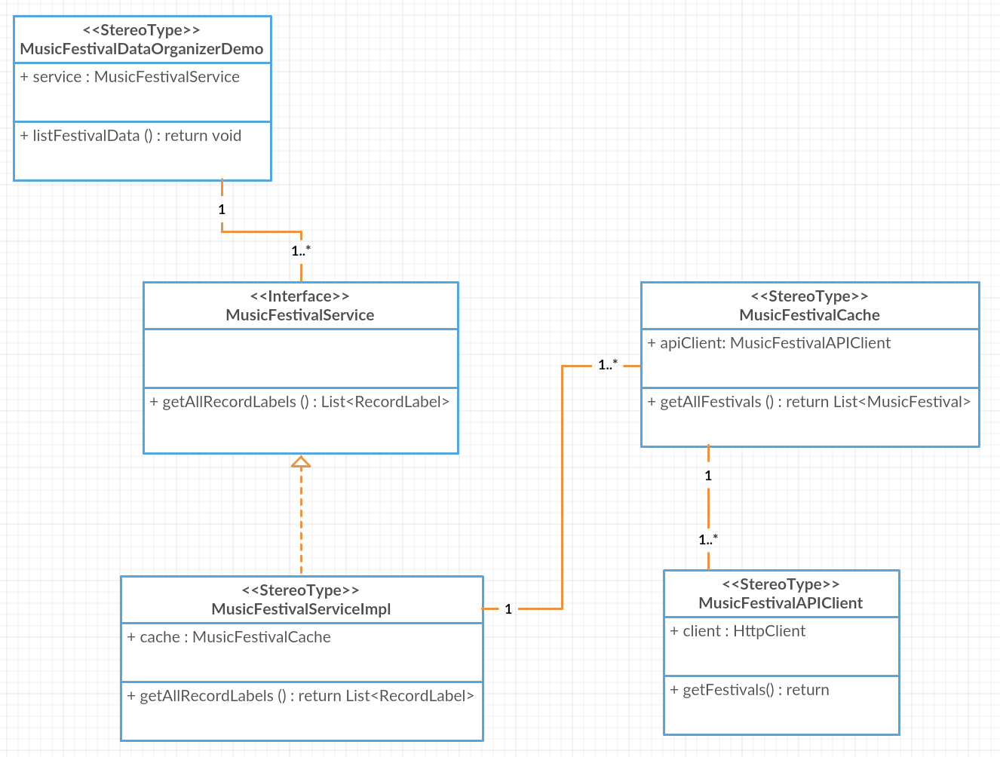
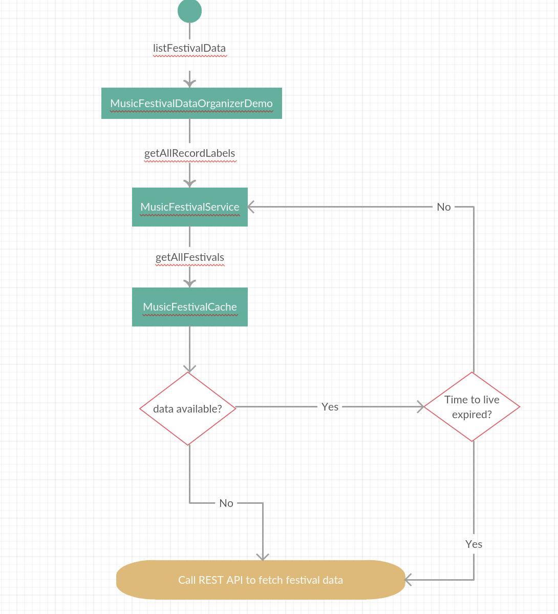

# MusicFestivalDataOrganizerDemo
Spring Boot application to restructure music festival data

## Building the application
mvn clean install

## Running the application
mvn spring-boot:run -DoutputFileUri=OUTPUT_FILE.txt

## Problem Statement
Your team is tasked with listing out music festival data in a particular manner: at the top level, it should show the band record label, below that it should list out all bands under their management, and below that it should display which festivals they've attended, if any. All entries should be sorted alphabetically.

For example:  
Record Label 1 
&nbsp;&nbsp;&nbsp;&nbsp;Band X 
&nbsp;&nbsp;&nbsp;&nbsp;&nbsp;&nbsp;&nbsp;&nbsp;&nbsp;Omega Festival 
&nbsp;&nbsp;&nbsp;&nbsp;Band Y 
Record Label 2 
&nbsp;&nbsp;&nbsp;&nbsp;Band A 
&nbsp;&nbsp;&nbsp;&nbsp;&nbsp;&nbsp;&nbsp;&nbsp;&nbsp;Alpha Festival 
&nbsp;&nbsp;&nbsp;&nbsp;&nbsp;&nbsp;&nbsp;&nbsp;&nbsp;Beta Festival 

The data is provided to you via an API by another team; they assure you all the data is available but it's in a different format and provide you with the Swagger documentation needed to get started.
Use this API as is to output the format specified above in any medium you desire; let it be a website, terminal, file or morse code if that's what you want to do - we just want to see the result somehow.

## Frameworks Used
- [Spring Boot](https://spring.io/projects/spring-boot) with Jersey

## Solution
This solution is implemented as a Spring Boot application that calls the REST API, restructures the festival data as per the given format and writes the result to a text file.

### CLass Diagram

### Activity Diagram

